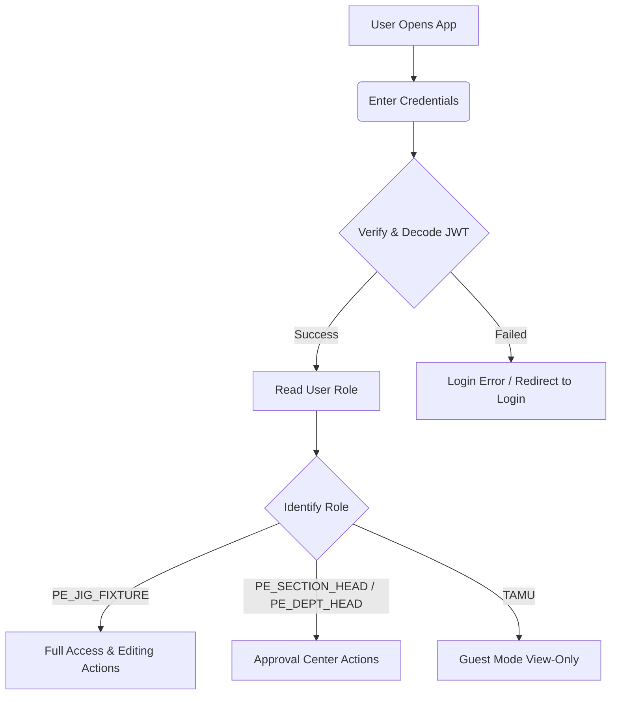
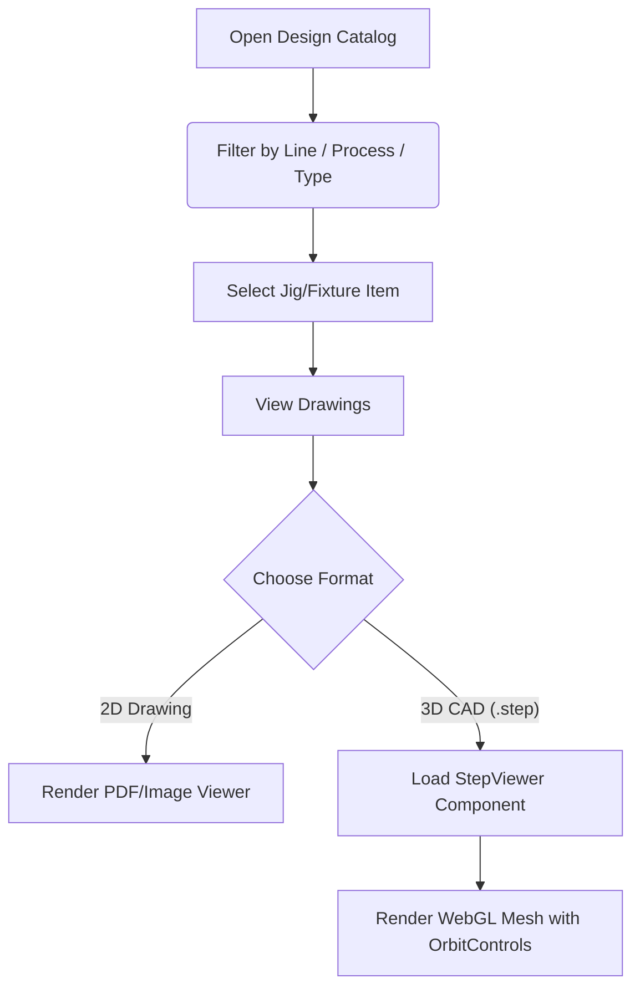
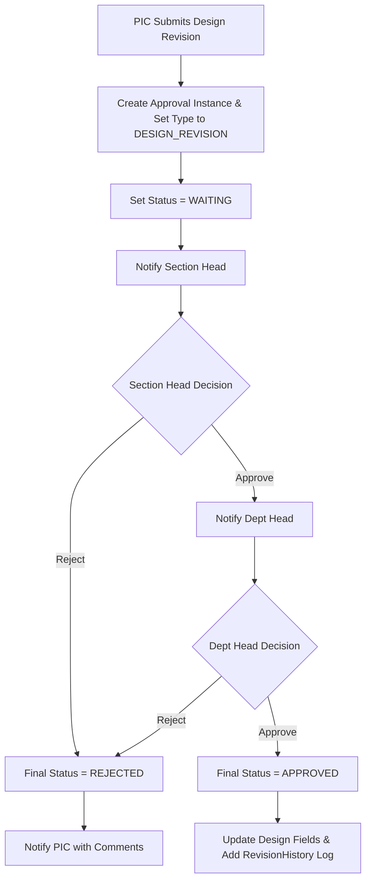
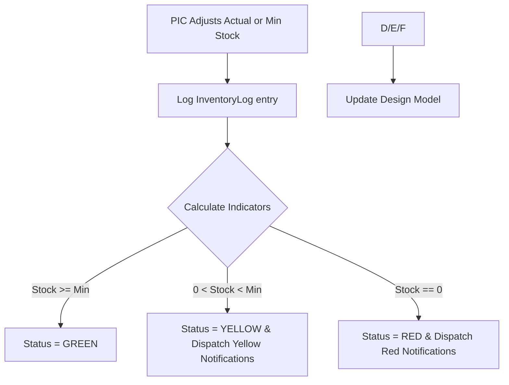
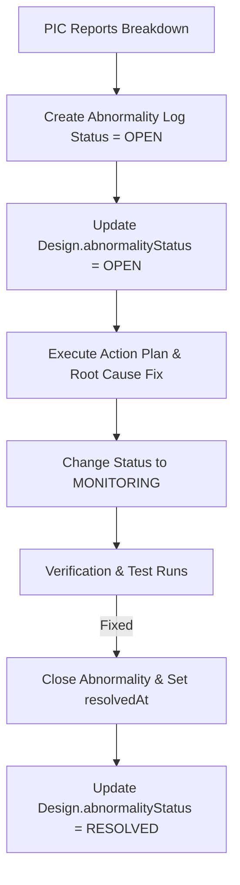

# 📐 System Design & Flow: Jig Fixture Management System

This document describes the complete architecture, database structure, and application flows of the **Jig Fixture Management System** (Process Engineering - Machining Department). Use this document to prompt LLM systems (such as Gemini) to build, modify, or extend the codebase.

---

## 🛠️ Technology Stack
- **Frontend:** Next.js (App Router), React, Tailwind CSS, Lucide React icons, Three.js (with OrbitControls for STEP/3D CAD viewing).
- **Backend:** NestJS 11, TypeScript, Prisma ORM, PostgreSQL.
- **WASM Support:** WebAssembly components used in the frontend to parse `.step` / `.stp` files locally in the browser.

---

## 📂 Project Architecture
The project is split into two main directories:
1. **Frontend:** [front/](file:///d:/PT%20MTM/Jig/front) (Next.js client)
2. **Backend:** [backend/](file:///d:/PT%20MTM/Jig/backend) (NestJS REST API server)

---

## 🗄️ Database Schema & Models
The data layer is modeled using Prisma. The primary database is PostgreSQL.
Refer to the schema file here: [schema.prisma](file:///d:/PT%20MTM/Jig/backend/prisma/schema.prisma)

### 1. Master Data Models
*   **[Role](file:///d:/PT%20MTM/Jig/backend/prisma/schema.prisma#L16-L24):** Defines user roles: `PE_JIG_FIXTURE` (PIC/Creator), `PE_SECTION_HEAD` (Section Head), `PE_DEPT_HEAD` (Dept Head), and `TAMU` (Guest view-only).
*   **[User](file:///d:/PT%20MTM/Jig/backend/prisma/schema.prisma#L26-L46):** System accounts containing NPK (employee ID), email, hashed password, and associated roles.
*   **[Line](file:///d:/PT%20MTM/Jig/backend/prisma/schema.prisma#L48-L57):** Production lines (e.g., Auto Assy Steering Stem, D38-Hub Clutch, UB Robot).
*   **[Process](file:///d:/PT%20MTM/Jig/backend/prisma/schema.prisma#L59-L68):** Production operations/phases (e.g., OP#1, OP#2).
*   **[Vendor](file:///d:/PT%20MTM/Jig/backend/prisma/schema.prisma#L70-L80):** Supplier or internal workshops (e.g., Internal Workshop PE).

### 2. Transactional & Main Models
*   **[Design](file:///d:/PT%20MTM/Jig/backend/prisma/schema.prisma#L86-L124):** The core entity of a Jig, Fixture, or Equipment item. Contains registration number (`noReg`), type (`JF`/`EQ`), stock thresholds, actual stock, and status flags:
    *   `inventoryStatus`: **GREEN** (OK), **YELLOW** (Warning), **RED** (Low Stock).
    *   `abnormalityStatus`: **RESOLVED**, **OPEN**, **IN_PROGRESS**.
    *   `lifecycleStatus`: `ACTIVE`, `UNDER_REPAIR`, `UNDER_IMPROVEMENT`, `OBSOLETE`, `SCRAP`.
*   **[Document](file:///d:/PT%20MTM/Jig/backend/prisma/schema.prisma#L131-L142):** Paths to 2D engineering drawings (PDFs/images).
*   **[RevisionHistory](file:///d:/PT%20MTM/Jig/backend/prisma/schema.prisma#L144-L167):** Logs changes to CAD drawings (2D/3D), revision status (0, 1, 2), PO numbers, cost, lead time, and designers.
*   **[Abnormality](file:///d:/PT%20MTM/Jig/backend/prisma/schema.prisma#L169-L193):** Log records for wear, deformation, or breakdowns of active fixtures. Details include root causes, actions, PIC, and linkage to design revision or spare orders.
*   **[InventoryLog](file:///d:/PT%20MTM/Jig/backend/prisma/schema.prisma#L201-L215):** Tracks inventory changes (minimum stock vs. actual stock adjustment history).
*   **[Notification](file:///d:/PT%20MTM/Jig/backend/prisma/schema.prisma#L217-L230):** System-generated alerts (e.g., stock shortages, pending approvals, reported abnormalities).
*   **[Approval](file:///d:/PT%20MTM/Jig/backend/prisma/schema.prisma#L232-L263):** Workflow records for design edits or stock corrections.

---

## 👥 Role & Permissions Matrix
| Action | `PE_JIG_FIXTURE` (PIC) | `PE_SECTION_HEAD` | `PE_DEPT_HEAD` | `TAMU` (Guest) |
| :--- | :---: | :---: | :---: | :---: |
| **View Catalog** | Yes | Yes | Yes | Yes (Approved Only) |
| **Download Drawings** | Yes | Yes | Yes | Yes |
| **Request Design Revision** | Yes | No | No | No |
| **Log Abnormality** | Yes | No | No | No |
| **Adjust Stock levels** | Yes | No | No | No |
| **Approval (Section Head)** | No | Yes | No | No |
| **Approval (Dept Head)** | No | No | Yes | No |

---

## 🔄 Core Application Flows & Workflows

### 🔐 1. Authentication & Role Assignment

---

### 📦 2. Design Catalog & CAD Viewer Flow
Users can browse, filter (by production line, process, and type), and inspect 2D/3D drawings.
- **3D CAD Preview:** Built using Three.js inside the [StepViewer.tsx](file:///d:/PT%20MTM/Jig/front/src/components/design/StepViewer.tsx) component. It loads `.step` or `.stp` model files and renders them natively, featuring OrbitControls, wireframe toggle, and brightness sliders.

---

### 📝 3. Design Update & Revision Workflow
When a Jig needs an optimization or correction:
1.  **Submission:** The `PE_JIG_FIXTURE` user submits a design update containing new 2D/3D file uploads, revision note, cost estimation, lead time, and PO details.
2.  **Approval Chain:**
    -   State starts at **WAITING**.
    -   `PE_SECTION_HEAD` reviews, adds comments, and signs off (**APPROVED** or **REJECTED**).
    -   `PE_DEPT_HEAD` reviews, adds final comments, and signs off.
    -   If either rejects, the workflow terminates, notifying the PIC.
    -   Once both approve, the system merges the new documents, increments `revStatus`, creates a `RevisionHistory` log, and updates the `Design` file.

---

### 📉 4. Inventory Tracking & Stock Alert Flow
Tracks stock quantities and dynamically calculates status indicators:
- **GREEN (Normal):** Actual Stock >= Minimum Stock.
- **YELLOW (Warning):** 0 < Actual Stock < Minimum Stock.
- **RED (Out of Stock):** Actual Stock == 0.

---

### ⚠️ 5. Abnormality Logging & Resolution Flow
Handles structural and quality breakdowns on production lines:
1.  **Log Abnormality:** PIC creates an abnormality report, defining abnormality type (`RUSAK`, `AUS`, `DEFORMASI`, `LAINNYA`), root cause analysis (4M1E framework), temporary action, and permanent corrective action.
2.  **Link to Action:** PIC determines if the corrective action requires:
    -   A design revision (`linkToRevision` = `true`).
    -   A spare part purchase order (`linkToSpare` = `true`).
3.  **Status Cycle:** Lifecycle moves from `OPEN` to `MONITORING`, and finally `CLOSED` when PIC resolves the breakdown.

---

## 💡 Prompt Guide for Gemini Banana
When requesting new code changes, paste this document along with your specific requirements.

**Example Prompt Structure:**
> Referencing the system design and schema in this document:
> 1. We need to implement a new feature: [Describe Feature]
> 2. This affects models: [Model Name]
> 3. Implement the backend controller endpoints in [backend path] and matching service logic.
> 4. Create the corresponding React UI components and state integration in [frontend path].
